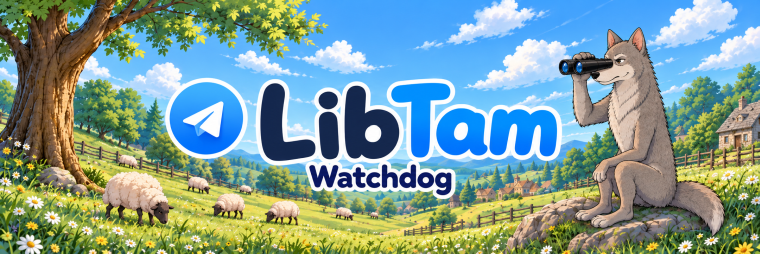

# Watchdog

Watchdog is a Telegram-controlled video surveillance script based on
[LibTam](https://github.com/andrewsml/libtam).

It connects webcams, screens, and RTSP cameras to a private Telegram forum
group. Each configured device gets its own topic for video calls, snapshots,
RTMP streams, motion detection, and scheduled recordings. Recorded videos are
saved in the Telegram group.

On the first successful Telegram login, LibTam automatically requests a free
two-month trial license. When it expires, use the Telegram bot
[@libtam_lic_bot](https://t.me/libtam_lic_bot) to extend the license for another
two months for free or to purchase a permanent license. Calls and media require
an active license.

## Precompiled Releases

You can download a ready-to-run version of Watchdog built with Nuitka from the
[Watchdog releases page](https://github.com/andrewsml/watchdog/releases).
Choose `watchdog-windows-x86_64.zip` for Windows or
`watchdog-linux-x86_64.zip` for Linux and extract the complete archive.

Start Watchdog with the launcher from the extracted directory:

``` text
Windows: start_watchdog.bat
Linux:   ./start_watchdog.sh
```

On the first run, enter your Telegram phone number and the authorization code
received in Telegram. Watchdog creates a private Telegram group where you can
add webcams, screens, microphones, and RTSP sources. Keep the extracted
directory structure unchanged.

On Windows, install the
[Microsoft Visual C++ Redistributable for Visual Studio 2022 (x64)](https://aka.ms/vs/17/release/14.44.35211/VC_redist.x64.exe)
before the first launch.

## Run from Source

Create an isolated Python environment, install the dependencies, install the
LibTam wheel for your platform, then run `watchdog.py`. Devices can be added
from the private Telegram group created by Watchdog.

Linux installation requires Ubuntu 24.04 or newer.

On Windows, install the
[Microsoft Visual C++ Redistributable for Visual Studio 2022 (x64)](https://aka.ms/vs/17/release/14.44.35211/VC_redist.x64.exe)
before installing and running LibTam.

``` bash
git clone https://github.com/andrewsml/watchdog.git
cd watchdog

python3 -m venv .venv
source .venv/bin/activate
# for Windows: .\.venv\Scripts\Activate.ps1

python3 -m pip install --upgrade pip
python3 -m pip install -r requirements.txt
python3 -m pip install 'libtam @ https://github.com/andrewsml/libtam/releases/download/v1.0.0/libtam-1.0.0-py3-none-linux_x86_64.whl'
# for Windows: python3 -m pip install "libtam @ https://github.com/andrewsml/libtam/releases/download/v1.0.0/libtam-1.0.0-py3-none-win_amd64.whl"

python3 watchdog.py
```

Telegram authorization uses a phone number in international format. On the
first run, enter the Telegram login code from your mobile Telegram client.

## Command Line

``` bash
python watchdog.py
```

Options:

- `--login` - Telegram account phone number in international format. The saved
  configuration is used when this option is omitted.
- `--lang` - interface language. Supported values: `en`, `ru`. Default: `en`.
- `--config` - use a custom configuration file instead of
  `media/stuff/watchdog_config.json`.
- `--video-size` - outgoing and recording video size. Supported values:
  `360p`, `480p`, `720p`. Default: `480p`.
- `--debug-log` - write RTSP call, RTMP, and motion diagnostics to
  `watchdog_debug.log`.

## How It Works

On startup, Watchdog creates or reuses a private Telegram forum group. Its name
depends on the selected interface language:

- English: `My Watchdog`
- Russian: `Мой Сторожевой`

The built-in `General` topic is used to manage devices. Each device has a
separate topic containing its controls and uploaded media.

Deleting a device topic from the Telegram group also removes the corresponding
device from `media/stuff/watchdog_config.json`. Closing or hiding a topic does
not remove the device.

Commands in `General`:

``` text
Help
Devices
Add webcam
Add screen
Add rtsp rtsp://login:password@ip_address/...
Cancel
```

Commands in a device topic:

``` text
Call or C
Screen or S
Stream On or S1
Stream Off or S0
Rec or r help
```

`Call` starts a private Telegram video call and streams the selected device.
`Screen` uploads a snapshot. Only one RTMP stream can be active at a time.

## License

On the first successful Telegram login, LibTam automatically obtains a free
two-month trial license bound to the Telegram user ID. Watchdog posts a
notification about the activated trial in the `General` topic. The automatically
managed license is stored in `tdlib/libtam_license.json`.

Use [@libtam_lic_bot](https://t.me/libtam_lic_bot) to extend the license for
another two months for free or to purchase a permanent license. Temporary and
permanent licenses are bound to the Telegram phone number used by Watchdog. If
no active license is available, Telegram calls and audio/video sending are
unavailable.

## Recording Schedule

Send `Rec help` or `r help` in a device topic to see the complete schedule
syntax.

Schedule commands:

``` text
rec or r <days>:<ranges>; <days>:<ranges>
rec motion <days>:<ranges>; <days>:<ranges>
rm <days>:<ranges>; <days>:<ranges>

rec show
rec clear
rec *:off
rec *:00-24
Motion On or M1
Motion Off or M0
```

Examples:

``` text
rec *:22-07
rec weekdays:09-18; weekend:off
rec *:00-24
rec motion *:22-07
rec show
rec clear
```

`rec motion` records only when the motion cascade confirms a relevant object.
The first stage uses exported H.264/H.265 motion vectors. OpenCV MOG2 then
checks low-resolution color samples from the current GOP, rejects global scene
or brightness changes, and marks likely shadows separately from foreground.
Finally, YOLOv10n must detect a person, animal, or vehicle overlapping the
motion region. The samples come from frames already decoded for motion-vector
extraction, so the GOP is not decoded a second time.

The compressed GOP is retained as a pre-roll buffer, so a confirmed recording
starts at the keyframe preceding the motion candidate. The detector and recorder
share one uninterrupted RTSP connection.

Uploaded recording captions use the current Telegram topic name. Renaming a
camera topic therefore changes captions for subsequent recordings without
changing the configured RTSP URL.

While recording, YOLO checks tracked objects once every five seconds. Each
presence check searches up to five recent frames sampled about one second
apart, newest first. This avoids closing a recording because one particular
frame misses a seated or partially occluded person. If all full-frame samples
miss, the newest samples are checked again using enlarged crops around the last
known occupant positions. Crop detections are mapped back to full-frame
coordinates before tracking. When one of several occupants is temporarily
missed, its last box remains a zoom-search anchor but does not count as a
successful presence check by itself. Recording starts only from a detection
with confidence at least 0.30 that overlaps the confirmed motion region. Once
the recording has opened, every detected person or animal in the frame
participates in presence tracking, including a seated occupant outside the
original motion region. Tracking uses a lower 0.10 presence threshold and
tolerates two missed checks, so a third consecutive miss is required to close
the file. A vehicle still uses the 0.30 threshold and keeps the recording open
only while motion vectors remain active and its YOLO box changes enough to
indicate actual displacement rather than detector jitter; a parked vehicle
therefore does not keep recording. Temporal and zoom fallbacks apply only to
people and animals; vehicle checks use the newest full frame. Other static
objects outside the initial motion region remain background. There is no fixed
one-minute inactivity delay.

When Watchdog starts, it checks for the official 8.95 MB `yolov10n.onnx` model
in `media/stuff/yolov10n.onnx`. If it is missing, Watchdog downloads it from the
[THU-MIG YOLOv10 v1.1 release](https://github.com/THU-MIG/yolov10/releases/tag/v1.1).
An existing model with the expected SHA-256 checksum is reused without a network
request. The model is loaded by OpenCV DNN only when the first YOLO check is
needed, keeping startup memory use low. PyTorch and the Ultralytics Python
package are not required. The upstream YOLOv10 repository and weights are
distributed under AGPL-3.0.

If a recording schedule exists, `Motion On` (`M1`) and `Motion Off` (`M0`)
enable or disable motion-only recording for that schedule. Without a schedule,
the same commands enable or disable motion event notifications.

## Runtime Files

Watchdog stores local state next to the script:

- `tdlib/` - TDLib authorization database, downloaded files, and the
  automatically managed initial trial license.
- `media/stuff/watchdog_config.json` - login, devices, schedules, Telegram
  group state, and RTSP connection data.
- `media/stuff/watchdog_en.json` and `watchdog_ru.json` - interface
  translations.
- `media/stuff/logo_512x512.png` - Telegram group logo.
- `media/stuff/yolov10n.onnx` - downloaded YOLOv10n object-detection model.
- `media/files/` - generated snapshots and recordings.
- `watchdog_debug.log` - optional debug log when `--debug-log` is used.

The TDLib directory and `watchdog_config.json` contain private account and
camera data and must not be committed to Git.
